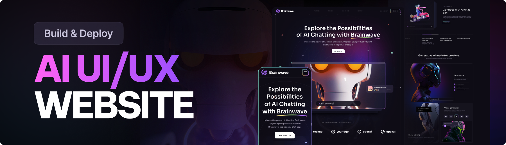

<div align="center">
  <br />
      
  <div>
  <br/>
    
    
    
    
    
  </div>

  <h3 align="center">Modern UI/UX website</h3>
</div>

## 📋 <a name="table">Table of Contents</a>

1. 🤖 [Introduction](#introduction)
2. ⚙️ [Tech Stack](#tech-stack)
3. 🔋 [Features](#features)
4. 🤸 [Quick Start](#quick-start)


## <a name="introduction">🤖 Introduction</a>

Brainwave - Modern UI/UX website, developed using React.js and Tailwind CSS, exemplifies modern UI/UX principles. Its sleek design, seamless animations, and overall user experience set a high standard, serving as a reference or inspiration for future modern applications or websites in general.


## <a name="tech-stack">⚙️ Tech Stack</a>

- Next.js
- React.js
- Tailwind CSS
- Bun
- Node.js

## <a name="features">🔋 Features</a>

👉 **Beautiful Sections**: Includes hero, services, features, how to use, roadmap, pricing, footer, and header.

👉 **Parallax Animations**: Engaging effects triggered by mouse movement and scrolling

👉 **Complex UI Geometry**: Utilizes tailwindcss for intricate shapes like circular feature displays, grid lines, and side lines.

👉 **Latest UI Trends**: Incorporates modern design elements such as bento grids.

👉 **Cool Gradients**: Enhances visuals with stylish gradients using Tailwind CSS for cards, buttons, etc.

👉 **Responsive**: Ensures seamless functionality and aesthetics across all devices

and many more, including code architecture and reusability

## <a name="quick-start">🤸 Quick Start</a>

Follow these steps to set up the project locally on your machine.

**Prerequisites**

Make sure you have the following installed on your machine:

- [Git](https://git-scm.com/)
- [Node.js](https://nodejs.org/en)
- [npm](https://www.npmjs.com/) 
- [bun](https://bun.sh/) (or)

**Cloning the Repository**

```bash
git clone https://github.com/serkanaplan/brainwave-nextjs.git
cd brainwave
```

**Installation**

Install the project dependencies using npm:

```bash
npm install or bun install
```

**Running the Project**

```bash
npm run dev or bun dev
```

Open [http://localhost:3000](http://localhost:3000) in your browser to view the project.
